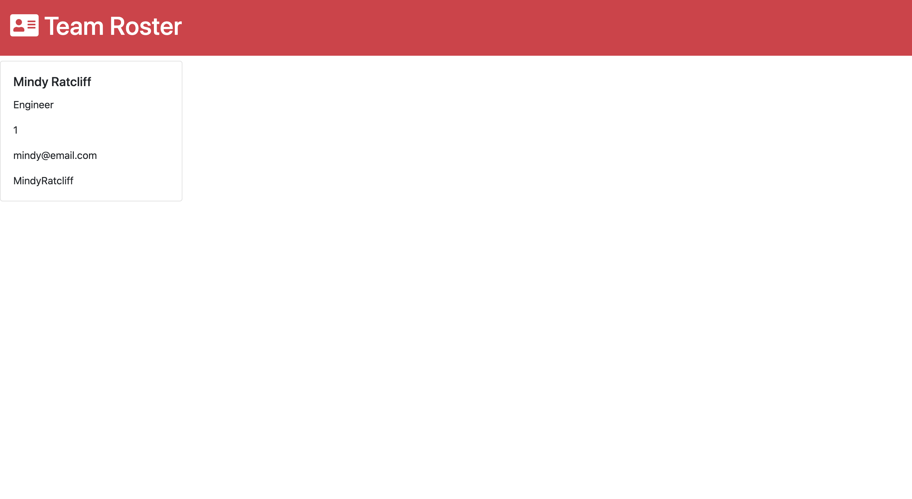

# Team Template Engine

 
   

 

This is a command line application which dynamically generates a team roster html file in order to track employee information.

## Table of Contents
1.) [Usage](#usage)

2.) [Installation](#installation)

3.) [Credits](#credits)

4.) [Contributing](#contributing)

5.) [Test Instructions](#test-instructions)

6.) [Questions/Contact](#questions/contact)

7.) [License](#license)

## Usage
To use this, the application is invoked by the command prompt with --- node app.js 

Screen Shot of Product 

Full Demo 

## Installation 
The user will need to have Node.js installed along with the Inquirier module. 
Be sure to npm i to install all dependencies! 

## Credits
References were made to www.nodejs.com and www.npmjs.com

## Contributing 
Please refer to the Contributor Covenant, version 2.0, available at https://www.contributor-covenant.org/version/2/0/code_of_conduct.html.

## Test Instructions 
In the tests folder, tests are available for each employee role. Run tests with Jest -- npm run test

## Questions/Contact 
Mindy Ratcliff
Mindyratcliff
mindy.ratcliff@gmail.com

## License
 

MIT License

Copyright (c) 2020 Mindy Ratcliff

Permission is hereby granted, free of charge, to any person obtaining a copy
of this software and associated documentation files (the "Software"), to deal
in the Software without restriction, including without limitation the rights
to use, copy, modify, merge, publish, distribute, sublicense, and/or sell
copies of the Software, and to permit persons to whom the Software is
furnished to do so, subject to the following conditions:

The above copyright notice and this permission notice shall be included in all
copies or substantial portions of the Software.

THE SOFTWARE IS PROVIDED "AS IS", WITHOUT WARRANTY OF ANY KIND, EXPRESS OR
IMPLIED, INCLUDING BUT NOT LIMITED TO THE WARRANTIES OF MERCHANTABILITY,
FITNESS FOR A PARTICULAR PUR
POSE AND NONINFRINGEMENT. IN NO EVENT SHALL THE
AUTHORS OR COPYRIGHT HOLDERS BE LIABLE FOR ANY CLAIM, DAMAGES OR OTHER
LIABILITY, WHETHER IN AN ACTION OF CONTRACT, TORT OR OTHERWISE, ARISING FROM,
OUT OF OR IN CONNECTION WITH THE SOFTWARE OR THE USE OR OTHER DEALINGS IN THE
SOFTWARE.
